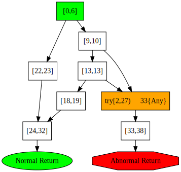

theme: APSA Lecture
autoscale: true
slidenumbers: true

# The Static Analysis Framework OPAL  

## Foundations and Analyzing Bytecode

Software Technology Group  
Department of Computer Science  
Technische Universität Darmstadt  
[Dr. Michael Eichberg](mailto:eichberg@informatik.tu-darmstadt.de)

---

# Introduction

 OPAL is a bytecode...
 
 - **analysis**
 
 - transformation
 
 - generation
 
platform written in Scala.

^ This first tutorial is primarily concerned with analyzing Bytecode.

--- 

# Requirements

 - Java 8

 - [Scala 2.12.8](http://scala-lang.org)
 
 - The build tool [sbt](http://scala-sbt.org)
 
^ Java 8 is in particular required if you want to use Visual Studio Code for writing your analysis. Do not forget to install the excellent [Scala Metals](https://scalameta.org/metals/) plug-in.

^ Scala is actually not strictly required, because it will be download by sbt if required. However, to do some Scala hacking and prototyping, a running Scala installation is helpful.

--- 

^ # OPAL's (sub)projects


^ - Common contains general algorithms and data-structures that are not specific to (Java (Bytecode)) analyses. E.g., logging functionality, parallelization related functionality, specialized data-structures.

^ - Static Analysis Infrastructure is a framework to facilitate the development of modular, parallelized static analyses. It is also not specific to  (Java (Bytecode)) analysis.

^ - Bytecode Infrastructure is a generic framework to efficiently parse Java Bytecode.

^ - Bytecode Disassembler provides a 1:1 object-oriented representation of a Java `.class` file. It is primarily useful when a precise understanding of every single byte of a class file is required. 

^ - The Bytecode Creator framework provides the functionality to serialize a class file in the representation provided by the Bytecode Disassembler to a byte array; the bytecode creator framework is used to create/manipulate class files.

^ - The Bytecode Assembler framework provides a small eDSL to generate Java Bytecode. The target of the assembler is the representation provided by the Bytecode Disassembler which is then serialized using the Bytecode Creator framework.

^ - The Bytecode Representation framework provides a high-level object-oriented representation of  Java Bytecode which is well suited for simple analyses which do not require the tracking of data-flow information. 
^   - The constant-pool is resolved to facilitate pattern matching
^   - Standard Java and Scala Invokedynamic instructions are rewritten
^   - Control-flows are normalized

^ - Abstract Interpretation Framework is a very lightweight framework for the abstract interpretation; currently it is primarily useful for intra-procedural analyses.

^ - The three-address code framework provides a high level register-based intermediate representation. It provides two basic representations:
^   - TACNaive which is an untyped three-address code like representation of Java bytecode 
^   - TACAI which is typed, SSA-like three-address code representation. This is the primary representation used by analysis.


---

# Analyzing software projects
^ **Template**:

[.code-highlight: 1]
[.code-highlight: 3-12]
[.code-highlight: 4]

```scala
object Main extends ProjectAnalysisApplication {

  def doAnalyze(
  	p: Project[URL], // The main entry point
	params: Seq[String], // App-specific parameters
	isInterrupted: () ⇒ Boolean // Should be called to test if the analysis should be aborted
  ): BasicReport = {
	// Here goes the analysis...    
	BasicReport("Done") // Here goes the analysis' result 
  }

}
```

^ You can get the template project using GIT:  
`git clone --depth 1 https://bitbucket.org/OPAL-Project/myopalproject Project`


^ The default template predefines several parameters which affect the instantiation of the `Project`. Most notably, `-cp=<Folder or Jar File which contains the class files you want to analyze>` and `-libcp=<Libraries used by the program that should be analyzed>`.
	
^ The template can directly be started using `sbt run`.

> Always ensure a proper project configuration to get reasonable results!


--- 

# Analyzing methods
^ **Template**:

[.code-highlight: 3-11]

```scala
object Main extends MethodAnalysisApplication {

    type Result = <Result Type>

    override def analyzeMethod(p: Project[URL], m: Method): Result = {
        // Here goes the analysis...
    }

    override def renderResult(r: Result): String = {
     	// Logic to render the results...
    }
}
```

^ By extending `MethodAnalysisApplication` you'll inherit additional functionality that automatically searches a specific method belonging to a specific class based on the patterns specified by the user. This template extends the `ProjectAnalysisApplication` based template.


---

# Batch-processing class files

^ In some cases it is sufficient to just process the class files one after another. While we do not provide a template for this case developing such an analysis is straight forward:

[.code-highlight: 1]
[.code-highlight: 4-6]

```scala
org.opalj.br.reader.Java9Framework.processClassFiles(
    List(new java.io.File("<Root Folders>")), // <= the root folders
    _ => (), // <= suppress debug info
    { case (cf,url) =>     
    	// Here goes the analysis.
    },
    org.opalj.bi.reader.ClassFileReader.SuppressExceptionHandler
) 
```

^ `Java9Framework.processClassFiles` is a higher-order function that takes your analysis (lines 4-6) that should be executed per class file (actually the pair `(ClassFile,URL/*Source of the class file*/)`).

---

# org.opalj.br.analyses.Project
 
 - Primary representation of a Java project:
   - Defines methods to access a project's class files, methods and fields. (e.g., `allMethodsWithBody`).
   - Access to a project's `classHierarchy`.
   - Provides functionality to resolve method calls/field accesses.
   - Central entry point to get further project-wide information on demand.

^ A `Project` is required for most advanced analyses.  	
	
^ An instance of a `org.opalj.br.analyses.Project` represents the concrete project that will be analyzed. OPAL distinguishes between the code that belongs to the project and the project's libraries. Depending on the requirements of the analysis libraries can completely be loaded or just the public interface. In the later case, the method bodies are omitted which safe some memory and speeds up the time required to load the classes. 

^ In real projects – in particular when libraries are analyzed - it is often practically unavoidable that the class hierarchy is not complete (e.g., the JDK references classes belonging to `org.eclipse` which are not part of the JDK). OPAL provides extensive support to handle such situations, but it is nevertheless highly recommended to analyze projects which are complete.

^ OPAL contains growing support for deliberately broken projects to enable the analysis of heavily obfuscated projects. 


---

# Iterating over a project's source elements

## Using For-comprehensions

```scala
val p : SomeProject = ... 
val publicMethods = for {
    classFile ← p.allClassFiles//.par
    method ← classFile.methods
    if method.isPublic
  } yield {
    method.toJava
  }
```

^ To only iterate over the _project's_ class files use `allProjectClassFiles`.

^ In many cases parallelization can be achieved in two different ways:
^  - using Scala's parallel collections 
^  - using OPAL's native parallelization methods

---

# Iterating over a project's source elements

## Using higher-order functions

```scala
val r = new java.util.concurrent.ConcurrentLinkedQueue[<ResultType>]()
p.parForeachMethodWithBody(isInterrupted) { mi ⇒
	val m = mi.method
}
import scala.collection.JavaConverters._
r.asScala.mkString("\n")
```

^ In general, the parallelization provided by OPAL is more efficient because it uses domain specific
knowledge to optimize the parallel execution. E.g., OPAL's `parForeachMethodBody` processes all methods in parallel starting with the longest method(s). This way the parallelization level can be increased; e.g., a random processing order could lead to the situation that the longest (most complex) method is scheduled to be analyzed last. In this case the overall analysis time is then heavily influenced by the time required to analyze that single very complex method.

---

# Iterating over the instructions of a method

The most efficient way to iterate over the body of a method is to use on of the respective methods provided by `Code`:

```scala
m.body.get.collect {
	case i @ INVOKEVIRTUAL(
			ObjectType.Object, 
			"toString", 
			MethodDescriptor.JustReturnsString
		) ⇒ i
}
```

^ Code provides a variety of methods that should suite most needs. 

^ It is also possible to iterate over the underlying instructions array. However, in most cases it is more efficient to use the `iterator` method provided by the `Code` object if you really want to use a for-comprehension. `for {i <- code.iterator}{...}`.

^ None of the methods is parallelized because in the very vast majority of cases the effort to parallelize the execution far outweighs the performance gains. 

---

# CFG for Java Bytecode

^ To get the `CFG` for a `Method` use the `CFGFactory`:

[.code-highlight: 2]
```scala
iomport org.opalj.br.cfg.CFGFactory
val cfg = CFGFactory(m : Method, classHierarchy : ClassHierarchy)

// A rudimentary class hierarchy is always available:
ClassHierarchy.PreInitializedClassHierarchy
```

^ The class hierarchy is required to correctly resolve exception handlers. If the class hierarchy is not complete it may happen that a control-flow edge is created to an exception handler that will never handle the respective exception at runtime. 

^ __Use the `PreInitializedClassHierarchy` only for testing purposes__!


^ Given the cfg it is then possible to, e.g., iterate over all blocks or to traverse the cfg:

```scala
val cfg = CFGFactory(m : Method, classHierarchy : ClassHierarchy)
cfg.allBBs // to iterate over all blocks in lexical order

cfg.startBlock // ... the initial start block
```

--- 

# CFG for Java Bytecode

In OPAL the CFG has four types of nodes:

 - (standard) basic block 
 - exit nodes:
   - normal return node
   - abnormal return node 
 - catch node (contains the information about the handled exception type) 

^ A basic block has a start and end pc and may have predecessors. A standard basic block always has at least one successor node.

^ In case of Java bytecode, the first block may have predecessors!

^ A catch node does not have any instructions and the successor is always a standard basic block;
that block, however, may have multiple predecessors; though this is very unlikely when the code was compiled from Java/Scala.

^ The predecessors of (ab)normal return nodes are always standard basic blocks.

--- 

[.slidenumbers: false]

^ OPAL provides extensive support for getting human readable representation of all core data-structures (e.g., the CFG).

 

^ The cfg only contains control-flow edges to the exception handler from those instructions that may throw an exception. Those instructions which never throw exceptions (e.g., `iinc`, `aload`, `if`) will never branch to an exception handler or abnormal return. 

---

# Performance Measurements

[.build-lists: true]

^ Measuring the performance of analyses is often a crucial part of their evaluation. However, doing so is challenging and often many (performance-relevant) questions are hard to solve.

^ Nevertheless, OPAL provides some support for performance measurements.

Using `org.opalj.util.PerformanceEvaluation.time` three types of performances measurements can be carried out:

 1. Measurement of some code:  
 `val r = time{/*Block to be measured*/}{t => /*time it took*/}`
 1. Repeated measurement of some code until the measurement has stabilized:  
 `val r = time[T](`  
  `epsilon: Int, consideredRunsEpsilon: Int, minNumOfRelevantRuns: Int,`  
  `f: ⇒ T, runGC: Boolean = false`  
  `)( r: (Nanoseconds, Seq[Nanoseconds]) ⇒ Unit): T`
 1. Collecting measurements:  
  `val r = time(<Group Symbol>){/*Block to be measured*/}{t => /*time it took*/}`


---

# Using ProjectInformationKeys

`ProjectInformationKey` objects are used to get/associate some (immutable) information with a project that should be computed on demand.
 
 When a concrete `ProjectInformationKey` is passed to the `Project` the respective analysis is triggered and the result is cached. 
 
 - Notable `ProjectInformationKey`s:  
   - `ProjectIndexKey`
   - `*TACAIKey`
   - `StringConstantsInformationkey`
   - `FieldAccessInformationKey`

^ The project index key enables a reverse lookup of methods and fields given the name (and descriptor) of a method.
^ The different TACAIKeys provide access to three-address code representation provided by OPAL. A specific analyses should always use only (at most) one of these keys.
^ The `StringConstantsInformationkey` is an index of all strings found in the source code.
^ The `FieldAccessInformationKey` provides the information about where a field is read/write accessed. Field accesses via reflection or `Unsafe` are not reflected.

^ > Analyses that compute information for `ProjectInformationKey`s are expected to be internally parallelized.

---

# Fundamental settings in the global configuration
 - Which kind of messages are logged
 - Which kind of transformations are performed
   - Control-flow simplification
   - Resolution of `invokedynamics`
 - Which kind of call graph is computed, which are the entry points, which packages are extensible,...
 
---

# Adapting the global configuration 
 
 - [LIghtbend](https://lightbend.github.io/config/) config based
   - default settings can be changed using an `application.conf` file which you put in your class path
   - the current configuration can be rendered using the command line parameter ("`-renderConfig`")  
   (When your analysis implementation inherits from (`Method`|`Project)AnalysisApplication`.)
   

---
# Excerpt of the global configuration

```json
org.opalj.br.reader {
    ClassFileReader {
        BytecodeOptimizer {
            simplifyControlFlow=true
        }
        Invokedynamic {
            rewrite=true
        }
        deleteSynthesizedClassFilesAttributes=true
    }
}
```

^ When you use the default configuration for processing Java class file, the bytecode representation that you will get is already transformed to a small degree when compared to the original bytecode. The transformations are done to facilitate subsequent analyses. If you need the raw bytecode use the `Bytecode Disassembler`. In that case, you'll have the guarantee that you get a 1:1 representation!


---

# Project specific configuration

 - Each project has its own configuration
 - The configuration can be adapted when a project is created

^ OPAL uses [Lightbend](https://lightbend.github.io/config/) Config for managing its configuration. That is, the default configuration is stored in the `reference.conf` files which are part of OPAL. To adapt the configuration to specific needs it is possible to specify an application.conf file. That file will overwrite the defaults. Alternatively, when a project is created it is possible to adapt the configuration to specific needs.


